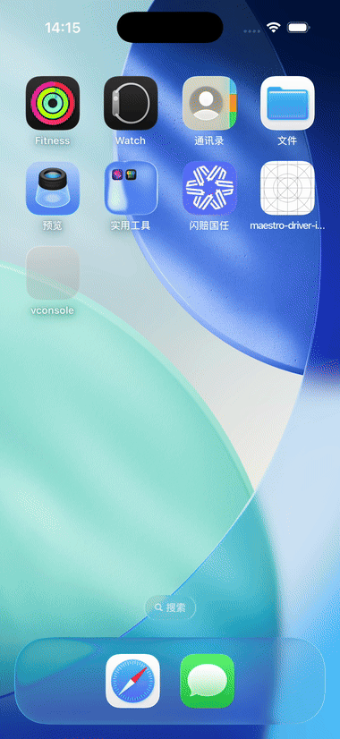

# vconsole-ios

仿 H5 vConsole 的 iOS 原生调试面板（Objective-C）。一个悬浮球 + 四个面板（日志 / 网络 / 存储 / 系统）+ 内置本地 Mock，零业务侵入，仅 DEBUG 生效。

<p align="center">
  
  <br>
  <sub>演示：日志（原生分级着色）→ 网络（真实请求 + JSON 美化）→ 存储 → 系统 →
  WKWebView 内 H5 <code>console.*</code> 捕获（日志面板「· H5」前缀）→ H5 请求捕获（网络面板「· H5」标记）</sub>
</p>

## 特性

**日志**
- `VConsoleLogV/D/I/W/E` 宏 + 自动捕获 `NSLog`/`fprintf`（自动剥离系统前缀）
- 关键词搜索（防抖）、级别筛选 chips、长按复制、详情页文本内查找/分享
- 上限 3000 条自动滚动淘汰；回到底部浮动按钮；未读 Error 角标
- 日志文字配色（浅色面板下清晰可读）：verbose/普通日志 **黑色**、debug 蓝、info 灰、warn 橙、error 红

**网络**
- `NSURLProtocol` 拦截 App 内所有 `NSURLSession`/`NSURLConnection` 请求（含流式请求体 multipart）
- 记录方法/URL/请求头/请求体/状态码/耗时/响应头/响应体（JSON 自动美化，50k 字符截断，2MB 捕获上限）
- 长按「复制 cURL 命令」（shell 转义，终端直接复现）、复制 URL/响应体/完整详情
- 筛选 chips：全部 / 仅失败 / 慢请求 >1s；毫秒级开始时间戳
- 内置 Mock：命中本地文件时不发真实请求，紫色标记，详见下文
- WKWebView 监控：页面内 fetch/XHR 自动捕获（青色 `· H5` 标记），业务零改动，详见下文

**存储**
- UserDefaults 键值浏览 + 沙盒目录逐层导航（Documents / Library / tmp）
- 文本文件预览（256KB 上限）、文件长按分享/删除、下拉刷新重新扫描

**系统**
- 设备型号、系统版本、屏幕、内存、电量（实时监控）等信息

**交互**
- 悬浮球：拖拽边缘吸附、位置持久化、长按菜单、闲置半透明、键盘避让
- 面板：弹簧开合动画、grabber 拖拽调高（比例持久化）、Tab 角标
- iPad：面板居中卡片布局 + 外接键盘快捷键（`Cmd+1~4` 切 Tab、`Esc` 关闭、`Cmd+F` 搜索）
- 全局 toast/空态/触觉反馈；设置持久化（主题/级别过滤/抓包开关/Mock 开关）

## 接入

### CocoaPods

```ruby
# 已发布到 GitHub（推荐）：指定仓库地址 + 分支
pod 'VConsole', :git => 'https://github.com/yanmin7857/vconsole.git', :branch => 'main'
# 本地开发迭代时可改回本地路径：
# pod 'VConsole', :path => '../vconsole-ios'
```

```objc
@import VConsole;   // 或 #import <VConsole/VConsole.h>

// AppDelegate -didFinishLaunchingWithOptions: 或 SceneDelegate -sceneWillConnectToSession:
[VConsole start];   // 自动定位前台窗口挂载，无需传 window
```

### Swift Package Manager

Xcode → Add Package Dependency → 选择本地目录（或仓库地址）。

```objc
@import VConsole;   // Objective-C
```

```swift
import VConsole    // Swift
```

### 说明

- 所有调试能力（悬浮球/面板/抓包/stderr 捕获）都在 `#ifdef DEBUG` 内；Release 构建下 `VConsoleLog*` 宏编译为空语句，`start` / `attachToWindow:` 为空实现，零运行时开销。
- 部署目标 iOS 9.0。

### Swift 使用

```swift
import VConsole

// AppDelegate / SceneDelegate：
VConsole.start()
```

`VConsoleLog*` 是 C 宏，Swift 中不可见，请直接调用 Logger：

```swift
VConsoleLogger.shared().log(VConsoleLogLevel.info, message: "hello from Swift",
                       file: #file, function: #function, line: #line)
```

### 编程式控制面板

对标 H5 vConsole 的 `vConsole.show()` / `vConsole.hide()` / `vConsole.showTab()`：

```objc
[VConsole show];
[VConsole hide];
[VConsole toggle];
[VConsole selectPanelTab:VConsolePanelTabNetwork];   // 0 日志 / 1 网络 / 2 存储 / 3 系统
```

`selectPanelTab:` 只切换 Tab、不改变面板显示状态，典型用途是在自动化演示 / 回归测试里
驱动面板，免去模拟点击（Demo 的 `-vcsDemo` 演示流程即基于它）。

### 关于 DEBUG 宏（CocoaPods 消费方必读）

CocoaPods 默认**不会**把宿主 App 的 `DEBUG` 宏传入 Pod target（只注入 `COCAPODS=1`），
而本库所有能力都由 `#ifdef DEBUG` 门控——如果不处理，消费方的 Debug 构建会得到空实现，
悬浮球完全不出现。本库 podspec 已通过条件 xcconfig
（`GCC_PREPROCESSOR_DEFINITIONS[config=Debug]`）显式注入，**消费方无需在 Podfile 添加
post_install 钩子**。SPM 侧 Xcode 按构建配置自动传递，Package.swift 亦做了显式兜底。

## 日志使用

```objc
VConsoleLogD(@"debug message");
VConsoleLogI(@"info: %@", obj);
VConsoleLogW(@"warn");
VConsoleLogE(@"error");

// JSON 自动美化展示
VConsoleLogI(@"%@", @{@"code": @0, @"msg": @"ok"});
```

## WKWebView 网络监控

`NSURLProtocol` 拦截不到 WKWebView 的网络——WebKit 的请求由独立进程发出，不经过
App 进程的 URL Loading System，这是 iOS 的系统级限制。vconsole 对此采用 **JS 钩子
方案**：attach 之后新建的 WKWebView 会被自动注入 document-start 脚本（hook
`XMLHttpRequest` / `fetch`），请求完成后经 `webkit.messageHandlers` 回传原生，
与原生请求混排进网络面板，以青色 `· H5` 标记区分。同一脚本还会 hook
`window.console` 的 `log/info/debug/warn/error`，H5 页面的控制台日志经 `vconsoleLog`
通道回传，进入「日志」面板，以 `· H5` 前缀 + 级别色（verbose/普通黑、debug 蓝、
info 灰、warn 橙、error 红）与原生日志区分，完整对标 Web 版 vConsole。

- **业务零改动**：无需持有或配置 WebView，swizzle 初始化器自动注入
- **捕获内容（网络）**：方法 / URL / 请求头 / 请求体 / 状态码 / 响应头 / 响应体 / 耗时
  （body 超 50k 字符在 JS 侧先截断，与原生一致）
- **捕获内容（控制台）**：多参数经 `JSON.stringify` 序列化后空格拼接，`debug→Debug`、
  `log/info→Info`、`warn→Warn`、`error→Error` 分级
- **无法捕获**：``/`<script>` 等静态资源标签加载（不经 JS，没有回调入口）；
  跨域响应若被 CORS 拦截，JS 读不到响应体，会记录为错误条目
- **开关**：跟随「设置 → 网络抓包」，关闭后已注入的页面也不再记录网络与控制台日志
- **限制**：`attachToWindow:` 之前已创建的 WebView、以及个别 Storyboard
  （`initWithCoder:`）实例不会被注入
- **噪声过滤**：两类纯噪声不收录——① URL 为空/全空白的「空接口」条目；② 响应体为空且
  响应字节数为 0 的「空响应」条目（含跨域拦截等无数据的失败请求）。原生与 WebView 两条
  链路统一在收录入口拦截，避免网络面板被无意义条目刷屏

验证方式：运行 Demo → 主页「WKWebView H5 测试（网络 + Console）」→
- **网络**：页面加载时已自动发出 fetch + XHR，回「网络」面板看青色 `· H5` 标记
- **H5 控制台**：点「H5 Console 测试」下的 `console.log/info/debug/warn/error`（或
  「全部级别」「对象 / 数组」），回「日志」面板即可看到 `· H5` 前缀、按级别着色的记录

> 演示动图重录（`-vcsDemo`，仅带该参数时触发，正常启动无任何自动行为）：
> ```bash
> # 1) 先启动 App（让桌面→App 的过渡发生在录制之前，动图里就不会出现 iOS 桌面）
> xcrun simctl launch booted com.vconsole.ios -vcsDemo
> sleep 2.4
> # 2) App 就绪后再开录；演示首帧刻意延后 2s，正好落在录制起点
> xcrun simctl io booted recordVideo demo.mp4    # 录约 22s 后 Ctrl-C 停止
> ```
> 演示顺序：日志（原生分级）→ 网络（真实请求）→ 存储 → 系统 → H5 页面 →
> H5 `console.*` 捕获 → H5 请求捕获，全程自动切 Tab，靠 `+selectPanelTab:` 驱动。

## 本地 Mock

在「设置 → Mock 数据」打开开关后，请求 URL 命中本地文件时直接返回本地数据（不发出真实网络请求，网络面板紫色标记）。

URL 路径约定：最后一段为 `action`，倒数第二段为 `module`。查找目录与优先级：

```
查找目录（按顺序）：
  1. <沙盒>/Documents/mock    ← 支持运行期热改（推文件即时生效）
  2. App Bundle 内 mock/ 目录  ← 随包内置（以 folder reference 方式添加）

三级查找（优先级从高到低）：
  1. mock/<Action>.json           整个文件内容即响应体
  2. mock/<Module>.json           JSON object，以 action 名为 key
  3. mock/mock.json               全局文件，支持 {module:{action:resp}} 嵌套
                                   与 {action:resp} 扁平两种结构
```

示例（URL `https://host/api/ECarSurveyAction/initSurveyInfo`）：

```
Documents/mock/
├── initSurveyInfo.json          ← 命中优先级最高（任何 module 下的同名 action）
├── ECarSurveyAction.json        ← {"initSurveyInfo": {...}, "submit": {...}}
└── mock.json                    ← {"ECarSurveyAction": {"initSurveyInfo": {...}}}
```

## 构建 Demo App

```bash
bash build.sh        # 编译 + 安装 + 启动到模拟器
```

## 运行单元测试

```bash
bash Tests/run_tests.sh   # 编译后在模拟器内运行纯逻辑测试
```

## 目录结构

```
Sources/vconsole/   库源码（35+ 文件，podspec 与 Package.swift 共用）
Demo/                演示 App（不进库）
Tests/               单元测试
build.sh             Demo 编译安装脚本
generate_xcodeproj.py 重新生成 vconsole.xcodeproj
```

## License

MIT
